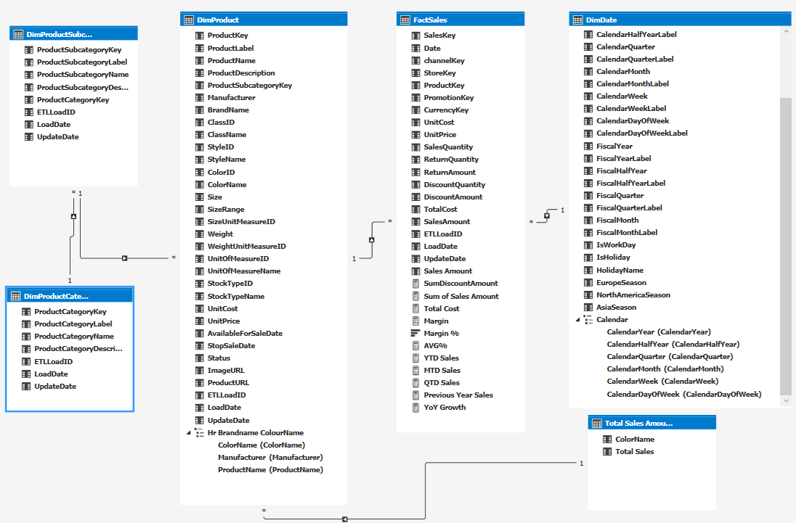
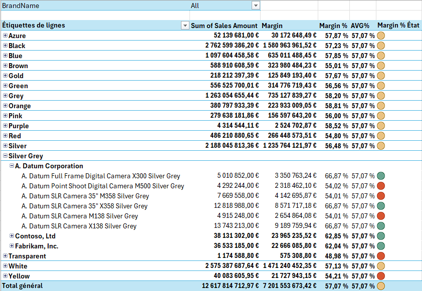
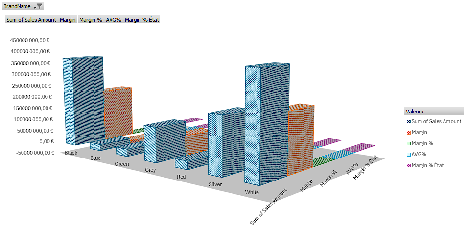
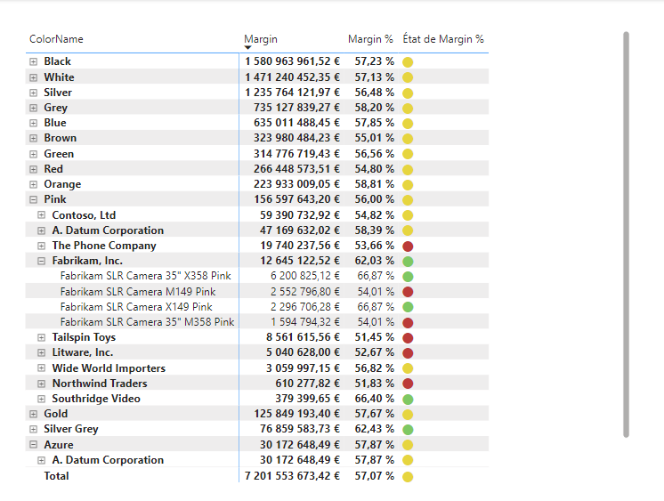
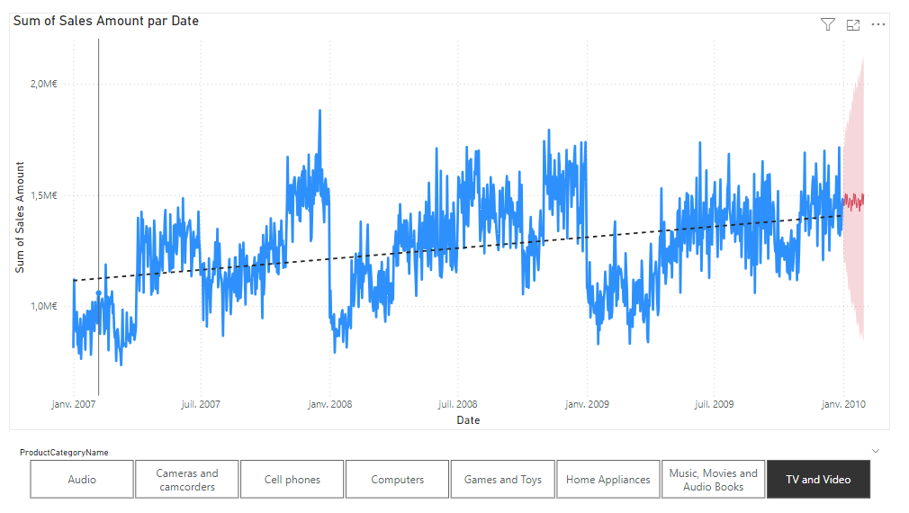
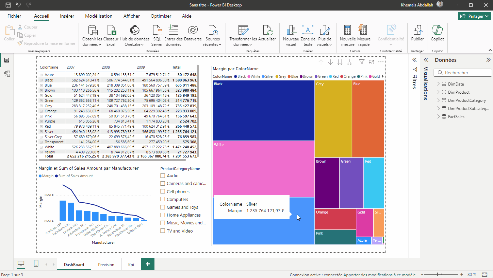

# PROJET Contoso

## Table de matière

- [PROJET Contoso](#projet-contoso)
  - [Table de matière](#table-de-matière)
  - [Introduction](#introduction)
  - [Modèle Tabulaires](#modèle-tabulaires)
  - [Excel](#excel)
    - [Pivot Table](#pivot-table)
    - [Histogramme](#histogramme)
  - [PBI](#pbi)
    - [Visuelle 1](#visuelle-1)
    - [Visuelle 2](#visuelle-2)
    - [Animation](#animation)
  - [Conclusion](#conclusion)

## Introduction

Ceci est un Projet **d'analyse** de donné avec SSAS, Excel et PowerBI basé sur la base de donné Contoso 

## Modèle Tabulaires

## Excel
Voici deux visuels avec EXCEL
### Pivot Table

### Histogramme

## PBI
Voici quelques Visuel  avec EXCEL
### Visuelle 1

### Visuelle 2

### Animation 

## Conclusion
Le but de Projet et ........

